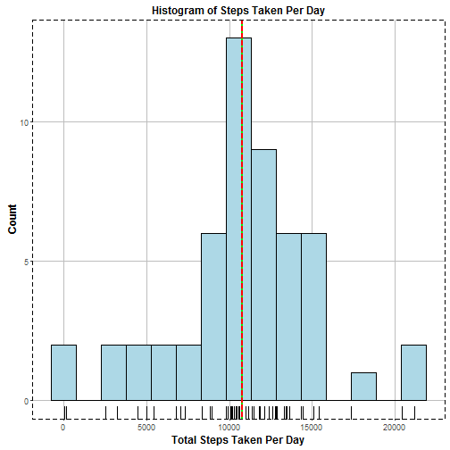
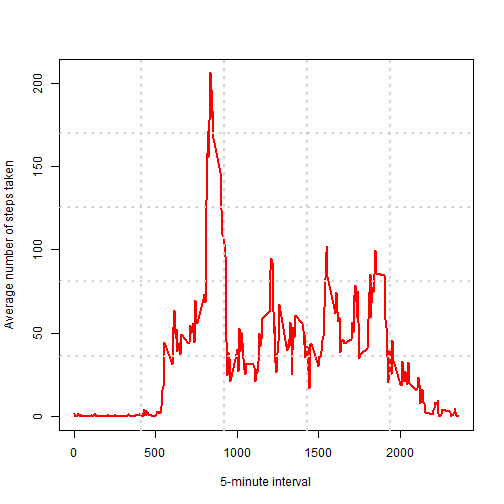
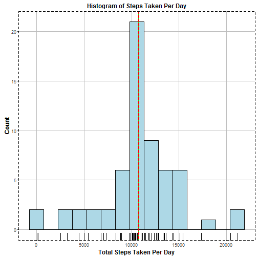
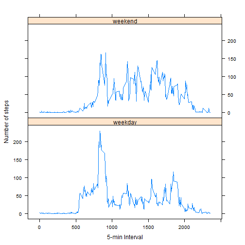

# Setup

### Clear workspace


```r
# Clear All Global Environiment Objects
rm(list = ls())
# Turn off warnings
options(warn=-1)
```

* * *

### Load packages


```r
library(choroplethr)
library(ggplot2)
library(dplyr)
library(lattice)
```

* * *

### Loading and preprocessing the data

```r
files=list.files(pattern = ".csv")
Original_Data=read.csv(files, header = TRUE, sep = ",")
```

* * *

### **<span style="color:blue">Research Question: What is mean total number of steps taken per day?**

Ignoring (removing) rows with NA's

```r
Data=Original_Data[complete.cases(Original_Data),]
```

Create dataframe with the total number of steps taken per day

```r
df=summarize(group_by(Data,date), StepsCount=sum(steps))
```


Plot histogram of the total number of steps taken each day

```r
ggplot(data=df, aes(x=StepsCount)) +
  geom_histogram(bins = 15, color="black",fill="light blue")+
  ggtitle("Histogram of Steps Taken Per Day") +
  labs(x="Total Steps Taken Per Day",y="Count")+
  theme(plot.title = element_text(family = "Trebuchet MS",  face="bold", size=12)) +
  theme(axis.title = element_text(family = "Trebuchet MS",  face="bold", size=12)) +
  theme(legend.background = element_rect(colour = "black"))  +
  theme(panel.background = element_rect(fill = "white"))+
  theme(panel.grid.major = element_line(colour = "grey"))+
  theme(panel.grid.minor = element_line(colour = "white", linetype = "dotted"))+
  theme(panel.border = element_rect(linetype = "dashed", colour = "black", fill=NA))+
  theme(legend.position="top")+ 
  geom_rug()+
    geom_vline(aes(xintercept = mean(df$StepsCount)), color = "red",size=1)+
    geom_vline(aes(xintercept = median(df$StepsCount)), color = "green",size=1,linetype=3)
```



#### **<span style="color:red">- Mean of the total number of steps taken per day is 10766.2**

#### **<span style="color:green">- Median of the total number of steps taken per day is 10765**

* * *

### **<span style="color:blue">Research Question: What is the average daily activity pattern?**

Create dataframe with the total number of steps taken per day

```r
df=summarize(group_by(Data,interval), StepsCount=mean(steps))
```

Time series plot of the 5-minute interval (x-axis) and the average number of steps taken, averaged across all days


```r
plot(x=df$interval, y=df$StepsCount,type = "l",ylab = "Average number of steps taken",xlab ="5-minute interval" ,col="red", lwd = 2)
grid(5, 5, lwd = 2) 
```



Next we estimate which minute interval has the  maximum numbers of steps.


```r
index=which(df$StepsCount==max(df$StepsCount))
minuteinterval_maxsteps=df$interval[index]
```

#### **<span style="color:red">- Minute interval, on average across all the days in the dataset, that contains the maximum number of steps is 835**

So it is the interval from 8:35 to 8:40.

* * *

### **<span style="color:blue">Imputing missing values**


Calculating total number of rows with NAs

```r
Data=Original_Data
check=is.na(Data)
Is_NA=Reduce("|", as.data.frame(check))
Row_NA=data.frame(Is_NA)

Stat=summarize(group_by(Row_NA,Is_NA), Count=n())
```

#### **<span style="color:red">- Total number of rows with NAs is 2304**


Filling in all of the missing values in the dataset for mean for that 5-minute interval


```r
df=summarize(group_by(Data,interval), MeanStepsCount=mean(steps, na.rm=TRUE))

for (i in 1:nrow(Data)){

  Interval=Data$interval[i]
  index=which(Interval==df$interval)
  
  if(is.na(Data$steps[i])==TRUE){
    
    Data$steps[i]= df$MeanStepsCount[index]
    
  }
}
```

Create dataframe with the total number of steps taken per day

```r
df=summarize(group_by(Data,date), StepsCount=sum(steps))
```


Plot histogram of the total number of steps taken each day

```r
ggplot(data=df, aes(x=StepsCount)) +
  geom_histogram(bins = 15, color="black",fill="light blue")+
  ggtitle("Histogram of Steps Taken Per Day") +
  labs(x="Total Steps Taken Per Day",y="Count")+
  theme(plot.title = element_text(family = "Trebuchet MS",  face="bold", size=12)) +
  theme(axis.title = element_text(family = "Trebuchet MS",  face="bold", size=12)) +
  theme(legend.background = element_rect(colour = "black"))  +
  theme(panel.background = element_rect(fill = "white"))+
  theme(panel.grid.major = element_line(colour = "grey"))+
  theme(panel.grid.minor = element_line(colour = "white", linetype = "dotted"))+
  theme(panel.border = element_rect(linetype = "dashed", colour = "black", fill=NA))+
  theme(legend.position="top")+ 
  geom_rug()+
    geom_vline(aes(xintercept = mean(df$StepsCount)), color = "red",size=1)+
    geom_vline(aes(xintercept = median(df$StepsCount)), color = "green",size=1,linetype=3)
```



#### **<span style="color:red">- Mean of the total number of steps taken per day is 10766.2**

#### **<span style="color:green">- Median of the total number of steps taken per day is 10766.2**


Conclusion: 

- The impact of the missing data seems rather low.
- The mean and median are practily the same.
- The histogram is very similar in shape.

* * *

### **<span style="color:blue">Research Question: Are there differences in activity patterns between weekdays and weekends?**

#### Create a new factor variable in the dataset with two levels - "weekday" and "weekend"


```r
Data$Day= weekdays(as.Date(Data$date))
Data$Daytype=ifelse(Data$Day=="Saturday" | Data$Day=="Sunday","weekend","weekday")
```

#### Panel plot


```r
Data_Weekday=filter(Data,Daytype=="weekday")
Data_Weekend=filter(Data,Daytype=="weekend")

df1=summarize(group_by(Data_Weekday,interval), MeanStepsCount=mean(steps))
df1$Daytype="weekday"

df2=summarize(group_by(Data_Weekend,interval), MeanStepsCount=mean(steps))
df2$Daytype="weekend"

df=rbind(df1,df2)


  xyplot(data=df,MeanStepsCount ~ interval|Daytype, type="l", 
            xlab="5-min Interval", ylab="Number of steps",layout=c(1,2))
```



CONCLUSION: 

- There is a difference in the pattern of steps taken during the weekdays in comparison to steps taken during the weekends. 
- It can be seen that the activity is more spread during the entire day during the weekends and  more concentrated in the first half of the day during weekdays.

* * *
